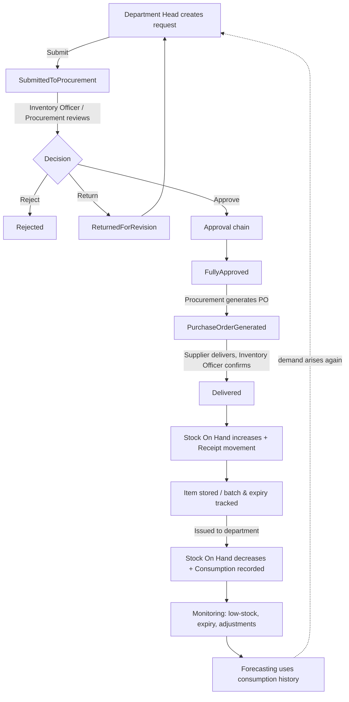

# Requirement Specification — PPH Integrated Procurement & Inventory Management System (IPMS)

**Organization:** Pangasinan Provincial Hospital
**Document purpose:** Explain the overall flow of the inventory system — where it starts, what happens next, and how each part connects — so a new team member (or evaluator) can understand the system end to end.

---

## 1. Overview

The IPMS manages the full life cycle of hospital supplies: from **requesting** items, through **approval and purchasing**, to **receiving, storing, issuing, and monitoring** stock, and finally **forecasting** future demand. Every meaningful action is **notified**, **audit-logged**, and included in the **daily backup**.

Think of the system as a loop:

> **Need an item → Request it → Get it approved → Buy it → Receive it → Store it → Issue it → Monitor & forecast → (need arises again)**

---

## 2. Actors (Roles)

Roles are defined in `UserRole`. Each sees a different slice of the flow.

| Role | Responsibility in the flow |
|------|----------------------------|
| **Department Head** | Raises procurement requests for their department. |
| **Inventory Officer** | Maintains stock, verifies item availability, receives deliveries, issues stock, requests adjustments, tracks expiry. |
| **Procurement Staff** | Reviews requests, manages suppliers, generates Purchase Orders. |
| **Hospital Administrator** | Final approver; approves adjustments; oversees admin (users, departments, categories, backups, audit logs). |
| **Super Admin** | Full system authority (can act at any approval stage). |

---

## 3. The Starting Point

The flow has **two starting points** — a one-time setup, then the repeating operational cycle.

### 3.1 Phase 0 — System Setup (the true starting point)

Before any transaction can happen, an administrator prepares the **master data**. This is the foundation everything else builds on:

1. **Users & Roles** — create accounts and assign roles (Admin → *Users*).
2. **Departments** — the requesting units of the hospital (Admin → *Departments*).
3. **Categories** — classification of supplies (Admin → *Categories*).
4. **Suppliers** — vendors that fulfil purchase orders (*Suppliers*).
5. **Inventory Items** — the catalog of trackable supplies, each with a **unit**, **reorder threshold**, and **expiration warning window** (*Inventory → Items*).

> Once master data exists, the operational cycle can begin.

### 3.2 The operational cycle

The recurring cycle is **demand-driven** — it begins when a department needs supplies (a **Procurement Request**). The sections below walk through it in order.

---

## 4. End-to-End Flow (step by step)



### Step 1 — Create a Procurement Request  *(Department Head)*
- A request is created with one or more items (quantity, estimated cost, remarks) and a justification.
- The system assigns a number: **`PR-YYYYMM-0001`**.
- Initial status: **`SubmittedByDepartment`** (a draft owned by the department).
- *Code:* `ProcurementService.CreateAsync`.

### Step 2 — Submit for review
- The department **submits** the request → status becomes **`SubmittedToProcurement`**.
- Notifications fire to **Procurement Staff** ("New Procurement Request") and **Inventory Officers** ("verify item availability").
- *Code:* `ProcurementService.SubmitAsync`.

### Step 3 — Approval chain
Reviewers **Approve / Reject / Return**. The status advances based on **who approves** and **the current status** (`ProcurementService.ProcessApprovalAsync`):

| Current status | Approver | New status |
|----------------|----------|------------|
| SubmittedToProcurement | Inventory Officer | **ApprovedByInventoryOfficer** (item available in stock) |
| SubmittedToProcurement | Procurement Staff | **ApprovedByProcurement** |
| ApprovedByProcurement | Inventory Officer | **ApprovedByInventoryOfficer** |
| ApprovedByInventoryOfficer | Hospital Admin / Super Admin | **FullyApproved** |
| *(any stage)* | *Reject* | **Rejected** (terminal) |
| *(any stage)* | *Return* | **ReturnedForRevision** → back to Step 1 |

> Hospital Admin and Super Admin can approve at earlier stages too (they can short-cut the chain).
> Every approval is recorded as a `ProcurementApproval` (who, role, level, action, remarks), and the requester is notified of the outcome.

### Step 4 — Generate a Purchase Order  *(Procurement Staff)*
- Allowed **only** when the request is **`FullyApproved`**.
- Procurement picks a **Supplier** and enters **unit costs**; the system creates a PO numbered **`PO-YYYYMM-0001`**, copies the approved items, and computes the total.
- Request status → **`PurchaseOrderGenerated`**; requester is notified.
- *Code:* `ProcurementService.GeneratePurchaseOrderAsync`.

### Step 5 — Confirm Delivery  *(Inventory Officer)*
When the supplier delivers, the officer confirms the PO. The system then:
1. Marks the PO **delivered**.
2. **Increases `QuantityOnHand`** for each item by the quantity ordered.
3. Writes a **`Receipt`** stock movement (before/after quantities, linked to the PO) — this is how stock officially enters the system.
4. Sets the request status → **`Delivered`** (the request cycle is complete).
- *Code:* `ProcurementService.ConfirmDeliveryAsync`.

### Step 6 — Store & track expiry  *(Inventory Officer)*
- Items are stored; perishable stock is recorded as **Item Batches** with **lot number** and **expiration date** (*Inventory → Batches & Expiry*).
- A background service checks batches **daily** and sends **Expiration Warnings** to Inventory Officers and Hospital Admins based on each item's warning window; expired stock is flagged.
- *Code:* `ExpirationCheckService`.

### Step 7 — Issue stock (consumption)  *(Inventory Officer)*
Stock leaves inventory through **Stock Movements** (`StockMovementService.CreateAsync`):

| Movement type | Effect on stock |
|---------------|-----------------|
| **Receipt** | + increases (e.g. delivery) |
| **Return** | + increases (returned to store) |
| **Issuance** | − decreases (given to a department) |
| **Disposal** | − decreases (expired/damaged) |
| **Adjustment** | sets to a corrected count (see Step 8) |

On every **Issuance**:
- A **monthly `ConsumptionRecord`** is created/updated (this feeds forecasting).
- If the new quantity drops to or below the item's **reorder threshold**, a **Low Stock Alert** is sent to Inventory Officers — which typically triggers a new request (loop back to Step 1).

### Step 8 — Stock Adjustments  *(Inventory Officer requests, Admin approves)*
For physical-count corrections (`StockAdjustmentService`):
1. Officer submits a count → status **`Pending`**; Hospital Admin is notified.
2. Admin **approves** → `QuantityOnHand` is set to the physical count and an **`Adjustment`** stock movement is recorded; or **rejects** → no change.
3. The requester is notified either way.

### Step 9 — Forecasting
- Using the monthly `ConsumptionRecord` history, the system projects future demand via **Moving Average** or **Exponential Smoothing** (`ForecastMethod`), helping decide **what and when to reorder** — closing the loop back to Step 1.
- *Module:* *Demand Forecasting*.

---

## 5. Cross-cutting Features (always running)

| Feature | What it does | When |
|---------|--------------|------|
| **Notifications** | Real-time alerts (SignalR) for submissions, approvals, low stock, expiry, adjustments. | On each triggering event. |
| **Audit Log** | Immutable record of who did what (create, approve, deliver, adjust, etc.). | Every state-changing action. |
| **Reports** | Exportable summaries of inventory, consumption, and procurement. | On demand. |
| **Backups** | Daily multi-sheet Excel snapshot of the whole database for disaster recovery (configurable time; 30-day retention). | Scheduled daily + manual. |

---

## 6. Procurement State Machine (quick reference)

```
SubmittedByDepartment
        │ submit
        ▼
SubmittedToProcurement ──approve(Inv.Officer)──► ApprovedByInventoryOfficer
        │                                                 │ approve(Admin)
        │ approve(Procurement)                            ▼
        ▼                                             FullyApproved
ApprovedByProcurement ──approve(Inv.Officer)──►          │ generate PO
                                                         ▼
                                             PurchaseOrderGenerated
                                                         │ confirm delivery
                                                         ▼
                                                     Delivered

Any review stage → Rejected (end) | ReturnedForRevision → back to department
```

---

## 7. Glossary

- **Reorder threshold** — stock level at or below which a Low Stock Alert is raised.
- **Consumption record** — per-item, per-month quantity issued; the basis for forecasting.
- **Item batch** — a received lot of an item with its own lot number and expiration date.
- **Stock movement** — the ledger of every quantity change (Receipt/Issuance/Return/Disposal/Adjustment).
- **PR / PO** — Procurement Request / Purchase Order.
